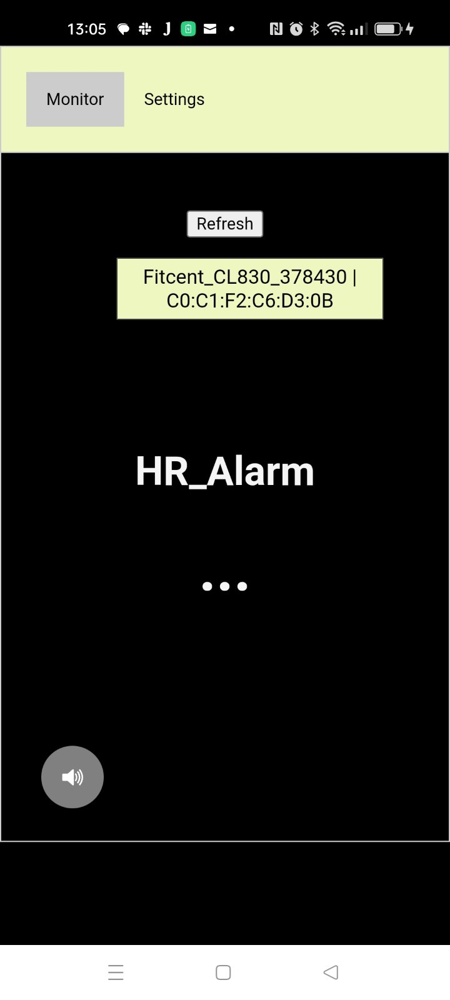

**Disclaimer:** I am not a medical professional, no clinical trials have or will be performed on this software. Use of any code within this repository is entirely at your own risk. It should be noted that not all seizures are the same and what works for detecting one persons may not work for another, also no seizure alarm can guarantee detecting every seizure including some very serious.

## Heart Rate Alarm

This App works by monitoring heart rate and will issue an audible alert in the event of the heart rate exceeding some definable parameters. 

I am developing this software to help monitor my daughters nocturnal epileptic seizures. I have tried using a commercial device, but it is not working for us as it goes into a low sensitivity mode if the wearer gets up and my daughter often sits or even stands up out of bed immediately prior to her seizures due to a feeling of nausea. We have also looked at other commercial devices and decided against for a number of reasons including:

- low sensitivity modes.
- Loudness of alarm - we want to be woken but some devices suited for hospitals / care homes are just too loud.
- Accelerometers - movement is not a big feature of our daughters seizures and we found they only raise false alarms for us.

 

If you are looking for an opensource solution based on heart and movement monitoring I would suggest looking at https://github.com/OpenSeizureDetector.

---

Connects to a peripheral providing the BLE Heart Rate Service. (Bluetooth 4.0+)

### Tested Devices
- [Fitcent Heart Rate Monitor](https://www.amazon.co.uk/dp/B09B342FXM?ref=ppx_yo2ov_dt_b_product_details&th=1) 
  Works fine, but needs to be manually turned on, may switch off automatically if not detecting heart rate for a few min.
- [Bangle JS 2](https://www.espruino.com/Bangle.js2)
  OK for testing but heart rate is very inaccurate.

Tested on Android 13.

    $ cordova platform add android

    $ cordova run

#### Disable Power Saving Options

Android Permissions are required to allow app to run in background and provide notification services, all power saving options should be turned off or set to least restrictive.

Some devices may require more drastic steps - see: https://dontkillmyapp.com/

- adb shell
- dumpsys deviceidle disable
- exit

## Screenshots

### Credits:
- https://github.com/tigoe/BluetoothLE-Examples/blob/main/cordova/beanNotify/www/js/index.js
- 