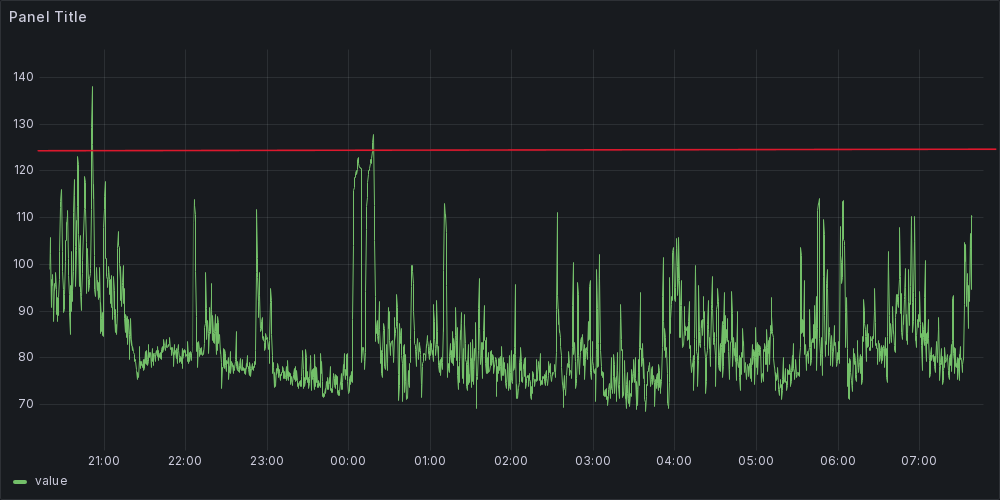

**Disclaimer:** I am not a medical professional, no clinical trials have or will be performed on this software. Use of any code within this repository is entirely at your own risk. It should be noted that not all seizures are the same and what works for detecting one persons may not work for another, also no seizure alarm can guarantee detecting every seizure including some very serious.

App is a work in progress and there is still much to do.

# Heart Rate Alarm

This App works by monitoring heart rate and will issue an audible alert in the event of the heart rate exceeding some definable parameters. 

I am developing this software to help monitor our daughters nocturnal epileptic seizures. We have tried using a commercial device, but it is not working for us as it goes into a low sensitivity mode if the wearer gets up and our daughter often sits or even stands up out of bed immediately prior to her seizures due to a feeling of nausea. We have also looked at other commercial devices and decided against for a number of reasons including:

- low sensitivity modes.
- Loudness of alarm - we want to be woken but some devices suited for hospitals / care homes are just too loud.
- Accelerometers - movement is not a big feature of our daughters seizures and we found they only raise false alarms for us.

This works by detecting a heartrate over a definable threshold for a definable number of samples. This way it can be tunned to detect heartrates outside of the wearers normal sleep pattern. So far this has been working very well for us at detecting even minor seizures with much fewer false alarms than we were having with the commercial device. Not everyone with epilepsy will have the same heartrate changes, there are options with more complex algorithms available, including the device we tried previously, but we found they were prone to more false alarms due to looking for more subtle changes in heartrate. Our daughter has a very distinct increase in heartrate at the start of her seizures.   

If you are looking for an opensource solution based on heartrate and movement monitoring I would suggest looking at https://github.com/OpenSeizureDetector.

---

## Devices

### Devices Tested

- [Fitcent Heart Rate Monitor](https://www.amazon.co.uk/dp/B09B342FXM?ref=ppx_yo2ov_dt_b_product_details&th=1) 
  Works fine, but needs to be manually turned on, may switch off automatically if not detecting heart rate for a few min.
- [Bangle JS 2](https://www.espruino.com/Bangle.js2)
  OK for testing but heart rate is very inaccurate.
- [COROS Heart Rate Monitor](https://www.amazon.co.uk/COROS-Auto-wear-Detection-Compatible-Connections/dp/B0CH8LJL3Y/?_encoding=UTF8&pd_rd_w=L2FQd&content-id=amzn1.sym.386c33bb-9a6d-4a4d-9a06-3bb24cb22d5d%3Aamzn1.symc.cdb151ed-d8fe-485d-b383-800c8b0e3fd3&pf_rd_p=386c33bb-9a6d-4a4d-9a06-3bb24cb22d5d&pf_rd_r=NH2YGMAA0KX69ASEKWAC&pd_rd_wg=Dt2w6&pd_rd_r=72082538-9d8c-4dd1-ad1c-dbc905b9d7cd&ref_=pd_gw_ci_mcx_mr_hp_atf_m&th=1&psc=1) 
Looks Promising as it has an auto wear detection feature, so shouldn't need to worry about manual power on or auto power off.

### Android Devices
- Tested on Android 13.
- [Oppo A54 5G](https://www.oppo.com/ie/smartphones/series-a/a54-5g/)
- [TECLAST P85T](https://www.amazon.co.uk/dp/B0CQJHVNCJ?psc=1&ref=ppx_yo2ov_dt_b_product_details) 8 inch Tablet 

## Software

### Cordova install

    $ cordova platform add android

    $ cordova run

### Node-Red

Node-Red is being used a server to monitor the App via a WebSocket. This will be used for graphing heart rate over night as well as test and debug of the App. May also be used in conjunction with a Notification service such as NTFY to alert if the App itself crashes.

### Disable Power Saving Options

Android Permissions are required to allow app to run in background and provide notification services, all power saving options should be turned off or set to least restrictive.

Some devices may require more drastic steps - see: https://dontkillmyapp.com/

- adb shell
- dumpsys deviceidle disable
- exit

## Grafana Graphs

### A Typical Night

  - Typical uneventful night.

### Single Focal Impaired Seizure

  - Peaks at beginning of night are a normal active child before settling down to sleep, these are the reason there is a mute button in the app.
  - 2 Peaks after midnight, first did not cross threshold value so did not alarm, second crossed the threshold and raised the alarm. This was a genuine seizure but effects were relatively minor, a little confusion and nausea for a few min.

### Seizure Activity Building Through Night

  - Multiple Alarms in night, built up to a severe focal impaired seizure.
  - Lasted several minuets with a long recovery with nausea and vomiting.
  - Child seemed OK for first couple of alarms but heartrate was increasing with each one.

## Screenshots

### Credits:
- https://github.com/tigoe/BluetoothLE-Examples/blob/main/cordova/beanNotify/www/js/index.js
- 